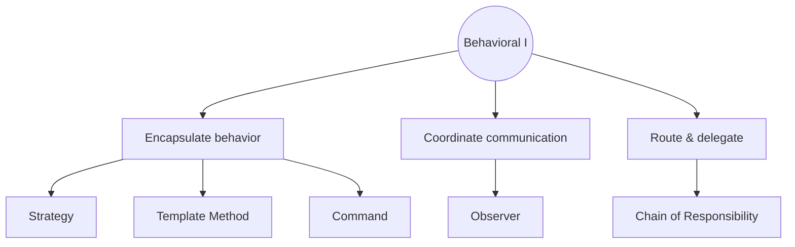
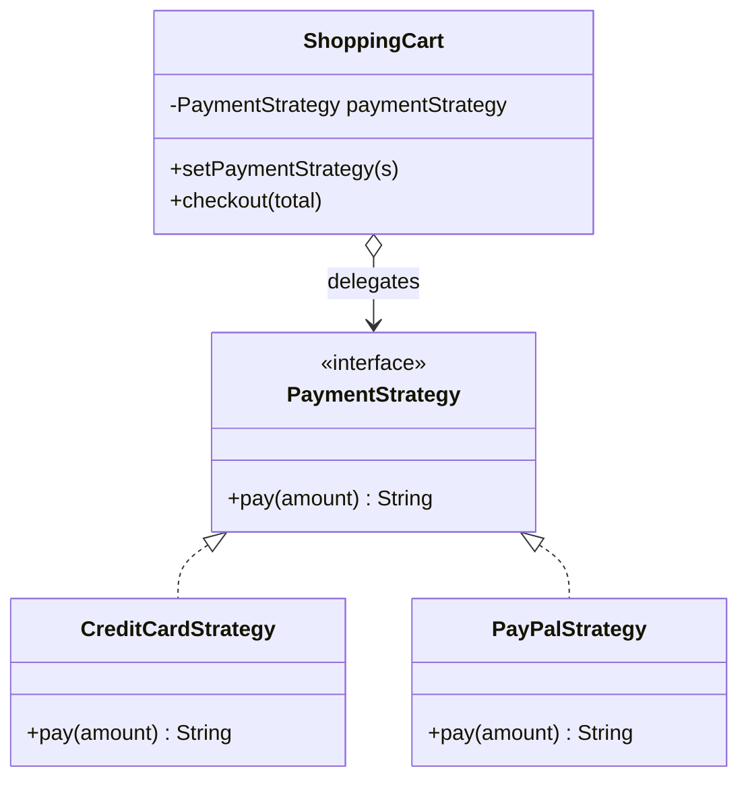
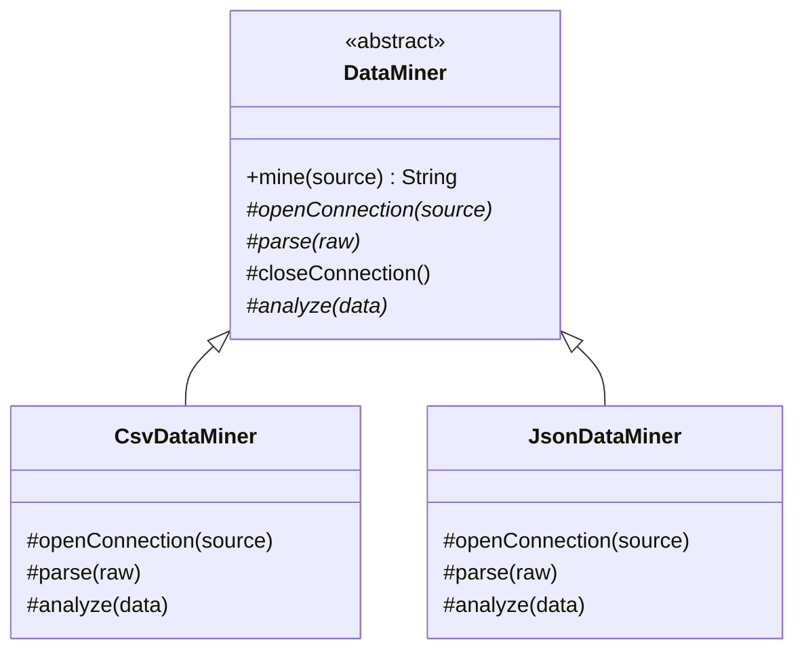
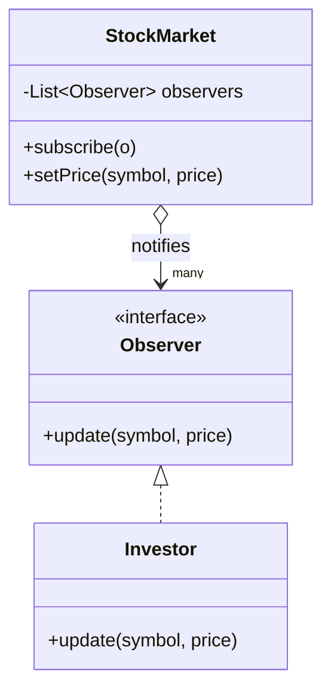
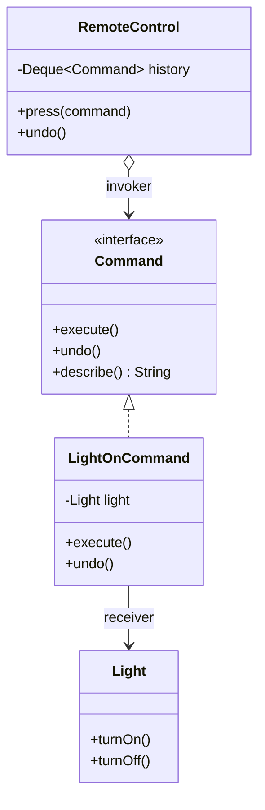
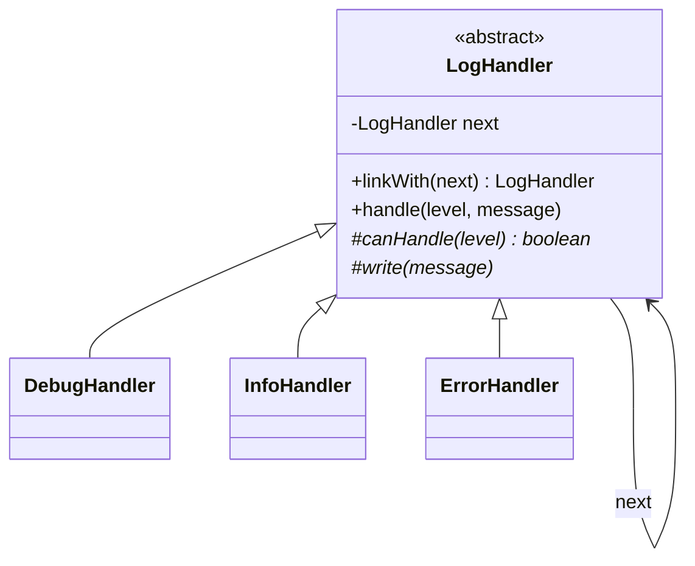
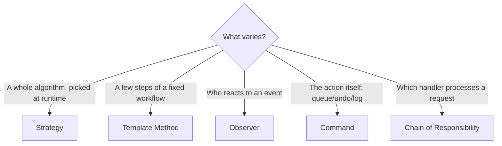

# Day 3: Behavioral Patterns I

**Date:** 23.06.2026
**Duration:** 09:30 – 13:00
**Audience:** Developers & QA Engineers
**Prerequisites:**
- [Day 1 — Creational Patterns](../../design-patterns/docs/DAY01-Introduction-Creational-Patterns.md)
- [Day 2 — Structural Patterns](../../design-patterns-part2/docs/DAY02-Structural-Patterns.md)

| Time | Module |
|------|--------|
| 09:30–10:30 | Module 8: Behavioral Patterns I (Strategy, Template Method, Observer) |
| 10:30–11:15 | Module 9: Behavioral Patterns II (Command, Chain of Responsibility) |
| 11:15–11:30 | Break (Fasilə) |
| 11:30–13:00 | Module 10: Hands-On Practice |

> **Next day:** [Day 4 — Behavioral Patterns II & Case Study](../../design-patterns-part4/docs/DAY04-Behavioral-Patterns-II.md) covers **State, Mediator, Memento, Iterator, Interpreter** (+ Visitor) and the File Sharing System case study.

**Companion code:** run all demos with `./gradlew run` from the project root (`design-patterns-part3`).

---

## Trainer Runbook (Agenda → Materials)

| Time | Module | Key talking points | Live demo command | Code to open |
|------|--------|-------------------|-------------------|--------------|
| 09:30–10:30 | Behavioral I | Strategy = swap an algorithm; Template Method = fixed skeleton, variable steps; Observer = publish/subscribe | `runStrategy` → `runTemplateMethod` → `runObserver` | `strategy/`, `templatemethod/`, `observer/` |
| 10:30–11:15 | Behavioral II | Command = action as object (+undo); Chain = pass the request along | `runCommand` → `runChain` | `command/`, `chain/` |
| 11:15–11:30 | Break | — | — | — |
| 11:30–13:00 | Hands-on | Attendees complete validation + observer TODOs; show solution **after** | `./gradlew test --tests "*.practice.validation.*"` then `"*.practice.observer.*"` | `practice/PRACTICE-TODOS.md` |
| Optional | QA deep dive | Same patterns in test automation | `./gradlew runQA` + `./gradlew test --tests "*.qa.*"` | `qa/` package |

**Homework (after session):** [DAY03-HOMEWORK.md](./DAY03-HOMEWORK.md) — instructor reference: `./gradlew runHomeworkSolution`

---

## Table of Contents

1. [Recap: Why Behavioral Patterns?](#recap)
2. [Behavioral Patterns at a Glance](#at-a-glance)
3. [Module 8: Behavioral Patterns I](#module-8)
   - [Strategy](#strategy)
   - [Template Method](#template-method)
   - [Observer](#observer)
4. [Module 9: Behavioral Patterns II](#module-9)
   - [Command](#command)
   - [Chain of Responsibility](#chain)
5. [Module 10: Hands-On Practice](#hands-on-practice)
6. [Behavioral Patterns for QA Engineers](#qa-patterns)
7. [Pattern Comparison & Decision Guide](#comparison)
8. [Universal Pitfalls & Anti-Patterns](#pitfalls)
9. [Glossary](#glossary)
10. [Further Reading](#further-reading)
11. [Day 3 Summary](#summary)

---

## Recap: Why Behavioral Patterns? {#recap}

The GoF catalog maps cleanly to three questions:

| Day | Category | Core question |
|-----|----------|---------------|
| **Day 1 — Creational** | Who creates objects? | Singleton, Factory, Builder, Prototype, Abstract Factory |
| **Day 2 — Structural** | How are objects composed? | Adapter, Bridge, Composite, Decorator, Facade, Flyweight, Proxy |
| **Day 3 — Behavioral** | How do objects communicate and share responsibility? | Strategy, Template Method, Observer, Command, Chain (Day 3) + State, Mediator, Memento, Iterator, Interpreter (Day 4) |

**Creational** patterns control *instantiation*. **Structural** patterns control *composition*. **Behavioral** patterns control *collaboration* — who talks to whom, in what order, and with what flexibility.

### The one idea behind all behavioral patterns

> **Isolate what varies in behavior, and make it pluggable.**

Almost every behavioral pattern is a different answer to the question *"what part of the behavior changes, and how do we let it change without rewriting everything around it?"*

- The **algorithm** changes → Strategy
- A **step** of a fixed workflow changes → Template Method
- The **set of things that react** to an event changes → Observer
- The **action** itself becomes data you can store/replay/undo → Command
- The **handler** that processes a request changes → Chain of Responsibility

They all lean on two design principles you've seen since Day 1:

1. **Program to an interface, not an implementation** — callers depend on `PaymentStrategy`, not `CreditCardStrategy`.
2. **Favor composition over inheritance** — inject collaborators instead of hard-wiring behavior into a tall class hierarchy.

### Why this matters: the cost of *not* using them

Behavioral problems rarely announce themselves. They show up as slow, painful symptoms over months:

| Symptom in production | Root cause | Likely fix |
|-----------------------|------------|------------|
| `if (paymentType == …)` repeated in 6 files | Behavior chosen by data, not polymorphism | **Strategy** |
| Four importers with copy-pasted try/finally and ordering | Duplicated workflow skeleton | **Template Method** |
| "Also send a Slack message" requires editing the order service | Tight coupling between event source and reactions | **Observer** |
| Undo is a giant `switch` that reverses each action by hand | Actions aren't first-class objects | **Command** |
| A 300-line dispatcher `switch` on request type/severity | Centralized routing that everyone edits | **Chain of Responsibility** |



### A word of caution before we start

Patterns are **medicine, not vitamins**. Each one trades simplicity for flexibility: more classes, more indirection, more files to open before you understand the flow. Apply a pattern when you feel *real, repeated pain* along a *known axis of change* — not because it looks professional. The [Universal Pitfalls](#pitfalls) section at the end is as important as any individual pattern.

---

## Behavioral Patterns at a Glance {#at-a-glance}

| Pattern | One-liner | Key benefit | Main cost | Mechanism |
|---------|-----------|-------------|-----------|-----------|
| **Strategy** | Swap an interchangeable algorithm | Add behaviors without touching callers | Class explosion; client must know the strategies | Composition |
| **Template Method** | Fixed skeleton, overridable steps | Removes duplicated workflow code | Inheritance lock-in; fragile base class | Inheritance |
| **Observer** | Notify many on a change | Decouples event source from reactions | Hard to trace flow; memory leaks; ordering | Callback registration |
| **Command** | Action as an object | Undo, queues, logging, macros | Many small classes | Object wrapping |
| **Chain of Responsibility** | Pass request along handlers | Add/reorder handlers freely | Request may go unhandled; debugging hops | Linked list of handlers |

**The two "twins" people confuse:** Strategy & Template Method solve the *same problem* (vary part of an algorithm) with *different mechanisms* (object composition vs. subclassing). Strategy & State (Day 4) have *identical class diagrams* but *different intent* (client picks vs. self-transitions).

---

## Module 8: Behavioral Patterns I {#module-8}

### Strategy {#strategy}

> **Intent (GoF):** Define a family of algorithms, encapsulate each one, and make them interchangeable. Strategy lets the algorithm vary independently from the clients that use it.

#### The problem

A checkout supports credit card today, PayPal next month, crypto after that. The naive version grows a `switch` that every new method must update:

```java
// ❌ Without Strategy — the switch spreads everywhere
public String checkout(String type, double total) {
    switch (type) {
        case "CARD":   /* card logic */   break;
        case "PAYPAL": /* paypal logic */ break;
        // every new method that touches payment repeats this switch
    }
}
```

Adding "Apple Pay" means hunting down every `switch (type)` in the codebase — and missing one is a production bug.

#### Structure



**Participants:**
- **Strategy** (`PaymentStrategy`) — the common interface for all algorithms.
- **Concrete Strategy** (`CreditCardStrategy`, `PayPalStrategy`) — one algorithm each.
- **Context** (`ShoppingCart`) — holds a strategy and delegates to it; doesn't know which concrete one it has.

#### In this repo

```java
// strategy/PaymentStrategy.java — the contract
public interface PaymentStrategy {
    String pay(double amount);
}

// strategy/ShoppingCart.java — the context delegates, never branches
public class ShoppingCart {
    private PaymentStrategy paymentStrategy;
    public void setPaymentStrategy(PaymentStrategy paymentStrategy) {
        this.paymentStrategy = paymentStrategy;
    }
    public String checkout(double total) {
        return paymentStrategy.pay(total);   // no switch, ever
    }
}

// strategy/CreditCardStrategy.java — one isolated algorithm
public class CreditCardStrategy implements PaymentStrategy {
    private final String lastFour;
    public CreditCardStrategy(String lastFour) { this.lastFour = lastFour; }
    @Override public String pay(double amount) {
        return "Charged $" + amount + " to card ending " + lastFour;
    }
}
```

```bash
./gradlew runStrategy
```

| Without Strategy | With Strategy |
|------------------|---------------|
| `switch (type)` in every method | One class per algorithm |
| Adding a method touches the switch everywhere | Add a class, implement the interface |
| Hard to unit-test one algorithm | Each strategy is independently testable |

#### Pros

- **Open/Closed**: add a new algorithm without modifying the context or existing strategies.
- **Eliminates conditionals**: replaces sprawling `if/switch` with polymorphism.
- **Testable in isolation**: each strategy is a small, pure unit.
- **Swap at runtime**: choose the algorithm based on config, user, or A/B test.

#### Cons / costs

- **Class proliferation**: ten algorithms = ten classes (mitigated by lambdas — a `PaymentStrategy` can be a lambda since it's a functional interface).
- **The client must know the strategies exist** to pick one — the knowledge moves, it doesn't disappear (often paired with a Factory to hide selection).
- **Communication overhead**: if strategies need lots of context data, the interface gets fat.

#### Common pitfalls

- **Leaky interface**: passing the whole `Context` into `pay()` just so one strategy can reach a field — keep the parameter list minimal and intentional.
- **Stateful strategies shared across threads**: prefer stateless strategies (or one instance per use) to avoid race conditions.
- **"Strategy" that's still a switch**: a single strategy class with an internal `switch (type)` is cargo-cult Strategy — the whole point is to delete the switch.

#### Symptoms — when to use

- You have two or more variants of an algorithm chosen at runtime.
- A class is littered with conditionals selecting behavior.
- You want to isolate algorithm details from code that uses them.

#### When NOT to use

- There's exactly one algorithm and no realistic second one coming — a plain method is simpler.
- The "variants" differ by a single value, not behavior — use a parameter or a `Map`, not classes.

#### Real-world use cases

- `java.util.Comparator` — the canonical Strategy (sorting order is pluggable).
- Spring `Validator` implementations; Spring Security `AuthenticationProvider`.
- Pricing/discount engines, tax calculators, shipping-cost calculators.
- Compression (`zip` vs `gzip`), retry/back-off policies, load-balancing algorithms.

#### Related patterns

- **Template Method** — solves the same "vary the algorithm" problem with inheritance instead of composition.
- **State** (Day 4) — same diagram; State transitions itself, Strategy is set by the client.
- **Factory** (Day 1) — frequently used to *choose* which strategy to instantiate.

---

### Template Method {#template-method}

> **Intent (GoF):** Define the skeleton of an algorithm in an operation, deferring some steps to subclasses. Template Method lets subclasses redefine certain steps of an algorithm without changing the algorithm's structure.

#### The problem

Every data importer does the same dance — *open → parse → analyze → close* — but the parsing differs per format. Copy-pasting the skeleton into each importer means a bug in the ordering (e.g. forgetting to close the connection) must be fixed in every copy.

#### Structure



**Participants:**
- **Abstract Class** (`DataMiner`) — defines the `final` template method `mine()` plus abstract "primitive operations" and optional **hooks** with defaults.
- **Concrete Class** (`CsvDataMiner`, `JsonDataMiner`) — implements the varying steps.

#### In this repo

```java
// templatemethod/DataMiner.java — the skeleton is final; steps are abstract
public abstract class DataMiner {
    public final String mine(String source) {     // the "template method"
        String raw = openConnection(source);
        String parsed = parse(raw);
        closeConnection();                          // always runs — defined once
        return analyze(parsed);
    }
    protected abstract String openConnection(String source);
    protected abstract String parse(String raw);
    protected void closeConnection() {              // a "hook" with a default
        System.out.println("  Connection closed");
    }
    protected abstract String analyze(String data);
}

// templatemethod/CsvDataMiner.java — only the variable steps differ
public class CsvDataMiner extends DataMiner {
    @Override protected String openConnection(String source) { return "CSV:" + source; }
    @Override protected String parse(String raw) { return raw.replace("CSV:", "rows="); }
    @Override protected String analyze(String data) { return "CSV analysis → " + data; }
}
```

```bash
./gradlew runTemplateMethod
```

The `mine()` method is `final` on purpose: subclasses customize *steps*, never the *order*. This is the **Hollywood Principle** — "Don't call us, we'll call you" — the base class drives, subclasses fill in blanks.

#### Pros

- **Removes duplication**: the workflow and its invariants (ordering, cleanup) live in exactly one place.
- **Enforces structure**: subclasses *can't* reorder or skip steps.
- **Hooks** give optional extension points without forcing every subclass to override them.

#### Cons / costs

- **Inheritance lock-in**: a class can extend only one template; you can't mix two skeletons.
- **Fragile base class**: changing the skeleton can silently break every subclass.
- **Inverted, harder-to-follow control flow**: reading one subclass doesn't reveal the full algorithm.
- **Liskov risks**: a subclass that misuses a hook can violate the base class's contract.

#### Common pitfalls

- **Forgetting `final`** on the template method — subclasses then override the whole algorithm and the guarantee is gone.
- **Too many abstract steps**: if every line is a hook, you've just reinvented a tangled interface; keep the variable surface small.
- **Deep hierarchies**: `A → B → C → D` template chains become spaghetti inheritance — prefer Strategy when variation grows.

#### Symptoms — when to use

- Several classes share an algorithm that differs only in a few steps.
- You want to enforce a sequence (e.g. setup → act → teardown) that callers must not break.
- You're writing a framework and want users to plug into well-defined extension points.

#### When NOT to use

- The steps need to vary independently and be combined freely → use **Strategy** (composition).
- You need runtime swapping of behavior → Template Method is fixed at compile time by the subclass.

#### Real-world use cases

- **JUnit** lifecycle: `@BeforeEach` → test body → `@AfterEach`.
- Spring `JdbcTemplate`, `RestTemplate` (you supply the row mapper / response handler; the template owns connection/cleanup).
- Servlet `HttpServlet.service()` dispatching to `doGet`/`doPost`.
- `java.io.InputStream.read(byte[])` calling the abstract `read()`.
- Build tools' lifecycle phases (Maven `validate → compile → test → package`).

#### Related patterns

- **Strategy** — the composition-based alternative; prefer it when variation is large or runtime-selected.
- **Factory Method** (Day 1) is itself a specialization of Template Method (a step that *creates* an object).

---

### Observer {#observer}

> **Intent (GoF):** Define a one-to-many dependency between objects so that when one object changes state, all its dependents are notified and updated automatically.

#### The problem

When a stock price changes, a dashboard, a mobile push service, and an audit log all need to react. Hard-coding those calls into the price-setter couples it to every consumer — and "also notify X" becomes a code change to the *publisher* every time.

#### Structure



**Participants:**
- **Subject** (`StockMarket`) — maintains the observer list; offers subscribe/unsubscribe; broadcasts changes.
- **Observer** (`Observer`) — the update interface.
- **Concrete Observer** (`Investor`) — reacts to notifications.

#### In this repo

```java
// observer/Observer.java
public interface Observer {
    void update(String symbol, double price);
}

// observer/StockMarket.java — the subject broadcasts without knowing who listens
public class StockMarket {
    private final List<Observer> observers = new ArrayList<>();
    public void subscribe(Observer observer) { observers.add(observer); }
    public void setPrice(String symbol, double price) {
        for (Observer observer : observers) {
            observer.update(symbol, price);   // push notification
        }
    }
}

// observer/Investor.java — a reaction the subject never references directly
public class Investor implements Observer {
    private final String name;
    public Investor(String name) { this.name = name; }
    @Override public void update(String symbol, double price) {
        System.out.println("  " + name + " notified: " + symbol + " now $" + price);
    }
}
```

```bash
./gradlew runObserver
```

**Push vs pull:** this demo *pushes* data (`symbol`, `price`) to observers. The alternative is *pull* — notify with no data and let observers query the subject. Push is simpler; pull decouples the notification from the data shape.

#### Pros

- **Loose coupling**: the subject knows only the `Observer` interface, not concrete consumers.
- **Open/Closed**: add a new reaction by registering a new observer — no change to the subject.
- **Dynamic**: subscribe/unsubscribe at runtime.

#### Cons / costs

- **Untraceable control flow**: a single `setPrice` can trigger a cascade of effects that's hard to follow in a debugger ("who reacted, and in what order?").
- **Ordering is undefined** (or list-order coupled) — observers shouldn't depend on running before/after each other.
- **Update storms / cascades**: an observer that updates the subject can cause re-notification loops.
- **Memory leaks (the lapsed-listener problem)**: forgetting to unsubscribe keeps observers (and everything they reference) alive — a classic source of leaks in GUIs and long-lived services.

#### Common pitfalls

- **No unsubscribe path** → memory leaks. Provide `unsubscribe`, and consider weak references for long-lived subjects.
- **Throwing observers**: one observer throwing can abort the whole notification loop; decide on isolation (try/catch per observer) deliberately.
- **Doing heavy work synchronously** inside `update()` blocks the publisher — offload to a queue/executor if needed.
- **Re-entrancy**: mutating the observer list while iterating it → `ConcurrentModificationException`; copy the list or use a concurrent structure.

#### Symptoms — when to use

- "When X happens, several unrelated things must react."
- You keep editing a producer just to bolt on another consumer.
- You want a publish/subscribe relationship with runtime registration.

#### When NOT to use

- There's exactly one consumer and there always will be — a direct method call is clearer.
- You need a guaranteed order, transactions, or delivery guarantees — reach for a real message broker/event bus.

#### Real-world use cases

- Spring `ApplicationEventPublisher` / `@EventListener`.
- GUI event listeners (Swing/JavaFX), DOM `addEventListener`.
- Reactive streams (RxJava, Project Reactor), `java.util.concurrent.Flow`.
- Kafka / RabbitMQ topics (distributed Observer), webhooks, CI build notifications.

#### Related patterns

- **Mediator** (Day 4) — centralizes *bidirectional* coordination; Observer is *one-way* broadcast.
- **Command** — observers often wrap their reaction as a Command for queuing/retry.

---

## Module 9: Behavioral Patterns II {#module-9}

### Command {#command}

> **Intent (GoF):** Encapsulate a request as an object, thereby letting you parameterize clients with different requests, queue or log requests, and support undoable operations.

#### The problem

A remote control button must work for lights today and a stereo tomorrow. If the button hard-codes `light.turnOn()`, it can't be reused, queued, logged, or undone. Undo logic ends up duplicated in a giant `switch` that reverses each action by hand.

#### Structure



**Participants:**
- **Command** (`Command`) — declares `execute()` (and here `undo()`/`describe()`).
- **Concrete Command** (`LightOnCommand`) — binds a **Receiver** to an action.
- **Receiver** (`Light`) — does the real work.
- **Invoker** (`RemoteControl`) — triggers commands and keeps history; knows nothing about lights.

#### In this repo

```java
// command/Command.java — action + reversal as one object
public interface Command {
    void execute();
    void undo();
    String describe();
}

// command/LightOnCommand.java — binds receiver to action; knows how to reverse itself
public class LightOnCommand implements Command {
    private final Light light;
    public LightOnCommand(Light light) { this.light = light; }
    @Override public void execute() { light.turnOn(); }
    @Override public void undo()    { light.turnOff(); }
    @Override public String describe() { return "Light ON"; }
}

// command/RemoteControl.java — the invoker stores history for undo
public class RemoteControl {
    private final Deque<Command> history = new ArrayDeque<>();
    public void press(Command command) {
        command.execute();
        history.push(command);          // record so we can undo later
    }
    public void undo() {
        if (!history.isEmpty()) history.pop().undo();
    }
}
```

```bash
./gradlew runCommand
```

Because the action is now an *object*, you get undo (reverse the last popped command), **macros** (a list of commands), **queues** (defer execution), and **logging/replay** (serialize commands) almost for free.

| Without Command | With Command |
|-----------------|--------------|
| Undo logic duplicated per action | Each command knows how to reverse itself |
| Cannot serialize/replay actions | Commands can be logged, queued, retried |
| Hard to add a "macro recorder" | Push commands to a history list |

#### Pros

- **Decouples invoker from receiver** — the button doesn't know what it controls.
- **Undo/redo** via stored history (and inverse operations).
- **Composable**: macro commands, command queues, scheduled/deferred execution.
- **Auditable**: commands can be logged and replayed (event sourcing, CQRS).

#### Cons / costs

- **Class proliferation**: one class per action (lambdas help for trivial commands).
- **Undo is hard to get right**: some operations aren't cleanly reversible (delete, network calls) — you may need Memento (Day 4) to snapshot state.
- **Memory**: long histories of heavy commands cost RAM.

#### Common pitfalls

- **Fat commands**: putting business logic *inside* the command instead of delegating to a receiver — the command should orchestrate, the receiver should do.
- **Non-idempotent undo**: `undo()` that doesn't exactly reverse `execute()` corrupts state; test the round-trip.
- **Shared mutable receiver** across queued commands changing state out from under them.

#### Symptoms — when to use

- You need undo/redo, macros, queuing, scheduling, or replay of operations.
- You want to decouple "what triggers an action" from "what performs it."
- You're modeling user actions, jobs, or transactions as data.

#### When NOT to use

- A simple direct call suffices and you'll never queue/undo/log it.
- The action has no meaningful "object" identity — don't wrap a one-off call.

#### Real-world use cases

- Undo/redo stacks in editors and IDEs; Photoshop history.
- Job/task queues, `java.lang.Runnable`, `java.util.concurrent` tasks.
- CQRS "commands", event sourcing, database transactions/replay logs.
- GUI actions (Swing `Action`), keyboard-shortcut mapping, Selenium IDE record & playback.

#### Related patterns

- **Memento** (Day 4) — store the receiver's prior state so `undo()` can restore it.
- **Composite** (Day 2) — a macro command is a composite of commands.
- **Strategy** — both wrap behavior; Command emphasizes *invocation + history*, Strategy emphasizes *interchangeable algorithm*.

---

### Chain of Responsibility {#chain}

> **Intent (GoF):** Avoid coupling the sender of a request to its receiver by giving more than one object a chance to handle the request. Chain the receiving objects and pass the request along the chain until an object handles it.

#### The problem

Support tickets route by category, log records route by level, HTTP requests pass through auth → CORS → rate-limit. A central dispatcher `switch` that decides "who handles this?" grows every time a new category appears and becomes a merge-conflict magnet.

#### Structure



**Participants:**
- **Handler** (`LogHandler`) — defines the interface and holds the `next` link.
- **Concrete Handler** (`DebugHandler`, `InfoHandler`, `ErrorHandler`) — handles what it can, else delegates.
- **Client** — builds the chain and fires the request at the head.

#### In this repo

```java
// chain/LogHandler.java — each handler either handles, or passes to next
public abstract class LogHandler {
    private LogHandler next;

    public LogHandler linkWith(LogHandler next) {
        this.next = next;
        return next;                       // fluent chain building
    }

    public void handle(LogLevel level, String message) {
        if (canHandle(level)) {
            write(message);
        } else if (next != null) {
            next.handle(level, message);   // delegate down the chain
        }
    }

    protected abstract boolean canHandle(LogLevel level);
    protected abstract void write(String message);
}

// chain/InfoHandler.java — a single-responsibility link
public class InfoHandler extends LogHandler {
    @Override protected boolean canHandle(LogLevel level) { return level == LogLevel.INFO; }
    @Override protected void write(String message) { System.out.println("[INFO] " + message); }
}
```

```bash
./gradlew runChain
```

**Two flavors:** in a *pure* chain exactly one handler consumes the request (like this logger). In a *pipeline* chain (servlet filters, middleware) **every** handler runs and may transform the request before calling the next — same structure, different stopping rule.

#### Pros

- **Decouples sender from receiver**: the client doesn't know which handler will act.
- **Open/Closed + reorderable**: add, remove, or reorder handlers without touching the others.
- **Single Responsibility**: each handler does one thing and is independently testable.

#### Cons / costs

- **No handling guarantee**: a request can fall off the end unhandled — you must decide on a default/terminal handler.
- **Harder debugging**: tracing which handler acted means hopping through the chain.
- **Performance**: long chains add per-request overhead.
- **Configuration risk**: a mis-wired chain (wrong order, broken link) is a silent logic bug.

#### Common pitfalls

- **Silent drop**: forgetting a fallback handler so unmatched requests vanish — add a catch-all/terminal handler.
- **Order-dependent bugs**: handlers that assume an earlier one ran; make dependencies explicit.
- **Broken links**: forgetting to set `next`, or accidental cycles causing infinite loops.
- **Handlers that both handle *and* pass on** when the contract says "exactly one" — pick a stopping rule and stick to it.

#### Symptoms — when to use

- More than one object may handle a request and the handler isn't known in advance.
- You want to issue a request without naming the receiver explicitly.
- The set/order of handlers should be configurable at runtime.

#### When NOT to use

- Exactly one known handler — call it directly.
- Every request must be handled and you need strong guarantees — a chain's "might fall through" semantics are a liability.

#### Real-world use cases

- **Servlet filters** / Spring Security filter chain (auth → CSRF → authz → controller).
- Logging frameworks (Log4j/SLF4J appenders & level filters).
- Middleware pipelines (Express.js, ASP.NET Core, Netty `ChannelPipeline`).
- Event bubbling in UI toolkits; exception handlers; approval workflows (L1 → L2 → L3).
- `java.util.logging.Logger` parent-handler delegation.

#### QA angle

`qa/chain` builds a failure pipeline — `ScreenshotHandler` → `LogHandler` → `NotifyHandler` — where each link handles one concern of a test failure and is independently testable.

#### Related patterns

- **Decorator** (Day 2) — both use recursive composition, but Decorator *always* forwards (adding behavior), while a pure Chain *stops* at the first handler.
- **Command** — the request passed along a chain is often a Command object.

---

## Module 10: Hands-On Practice {#hands-on-practice}

Attendees complete the TODOs. Full checklist: `src/main/java/com/designpatterns/day03/practice/PRACTICE-TODOS.md`.

| Exercise | Pattern | Package | Verify |
|----------|---------|---------|--------|
| A — Form validation | **Strategy** | `practice/validation/` | `./gradlew test --tests "*.practice.validation.*"` |
| B — Bug tracker notifications | **Observer** | `practice/observer/` | `./gradlew test --tests "*.practice.observer.*"` |

These map to the agenda's Module 10 scenarios:

- **Document Approval pipeline** → Chain of Responsibility (see HW2 Support Ticket Chain).
- **Observer for user registration** (send email + log event) → Exercise B.
- **Strategy vs Template Method for data export** → compare `strategy/` (inject behavior) with `templatemethod/` (override steps).

Instructor reference:

```bash
./gradlew runPracticeSolution
./gradlew runHomeworkSolution
```

---

## Behavioral Patterns for QA Engineers {#qa-patterns}

```bash
./gradlew runQA
./gradlew test --tests "*.qa.*"
```

| Pattern | QA class | What it shows |
|---------|----------|---------------|
| Strategy | `HardAssertStrategy`, `SoftAssertStrategy` | Swap assertion behavior per suite |
| Template Method | `UiTestFixture`, `ApiTestFixture` | Shared setup/run/teardown skeleton |
| Observer | `TestRunPublisher`, `SlackNotifier`, `EmailNotifier` | Fan-out test results to channels |
| Command | `NavigateCommand`, `ClickCommand`, `TestRunner` | Replayable test steps with undo |
| Chain | `ScreenshotHandler` → `LogHandler` → `NotifyHandler` | Failure-handling pipeline |

**Why QA engineers should care:** test frameworks *are* design patterns. JUnit's lifecycle is Template Method; `@ExtendWith` listeners are Observer; Selenium's record-and-playback is Command; a soft-assert library is Strategy. Recognizing the pattern makes the framework's behavior predictable — and makes your own page objects and fixtures cleaner.

---

## Pattern Comparison & Decision Guide {#comparison}

| If you need to… | Use |
|-----------------|-----|
| Swap one interchangeable algorithm at runtime | **Strategy** |
| Keep a fixed workflow but vary individual steps | **Template Method** |
| Notify many dependents when something changes | **Observer** |
| Turn an action into an object (queue / log / undo) | **Command** |
| Route a request through a series of handlers | **Chain of Responsibility** |



**Easy confusions:**
- **Strategy vs Template Method** — composition (inject an object) vs inheritance (override a step). Prefer Strategy when variation is large or runtime-selected; Template Method when you must *enforce* a sequence.
- **Strategy vs State (Day 4)** — identical diagrams; Strategy is chosen by the client and rarely changes, State transitions itself in response to events.
- **Observer vs Mediator (Day 4)** — one-way broadcast vs central bidirectional coordinator.
- **Command vs Strategy** — Command captures *what to do* (with undo/history); Strategy captures *how to do one step*.
- **Chain vs Decorator (Day 2)** — both chain objects; Chain may *stop* at one handler, Decorator *always* forwards while adding behavior.

---

## Universal Pitfalls & Anti-Patterns {#pitfalls}

Patterns solve problems — and *create* them when misapplied. Watch for these across **all** behavioral patterns:

### Over-engineering ("pattern soup")
Introducing an interface + three classes where a five-line method would do. **Rule of three:** wait until you have a real second (ideally third) variant before abstracting. Premature abstraction is harder to undo than a little duplication.

### Golden Hammer
"I just learned Strategy, so everything is a Strategy." Forcing one favorite pattern everywhere. Each pattern fits a *specific* axis of change — match the pattern to the variation you actually expect.

### Cargo-cult patterns
Copying a pattern's *structure* without its *intent* — e.g. a "Strategy" whose context still contains `switch (type)`, or a Chain where every handler also handles and forwards. The shape is right but the benefit is gone.

### Speculative generality
Adding hooks, parameters, and extension points "in case we need them." Unused flexibility is pure cost: more code to read, test, and maintain. Build for today's known change.

### Indirection overload
Every pattern adds a layer of indirection. Five patterns stacked in one feature can make a 10-line behavior span 10 files. Optimize for the *reader*: would a new teammate understand the flow faster with or without the pattern?

### Pattern-specific traps (quick reference)

| Pattern | Top trap | Guard |
|---------|----------|-------|
| Strategy | A strategy that still branches internally | Keep each strategy to one algorithm |
| Template Method | Non-`final` template; deep hierarchies | `final` the skeleton; switch to Strategy when variation grows |
| Observer | Lapsed-listener memory leak | Always provide & call `unsubscribe` |
| Command | `undo()` that doesn't truly reverse | Test the execute→undo round-trip |
| Chain | Request silently unhandled | Add a terminal/fallback handler |

> **The meta-rule:** refactor *to* patterns when duplication and pain appear — don't design *from* patterns up front.

---

## Glossary {#glossary}

- **Context** — the object that uses a pluggable behavior (e.g. `ShoppingCart` holding a `PaymentStrategy`).
- **Template method** — a method that defines an algorithm's skeleton and calls overridable steps.
- **Hook** — an optional step in a template with a default implementation a subclass *may* override.
- **Primitive operation** — an abstract step a subclass *must* implement.
- **Subject / Publisher** — the object whose changes are broadcast (Observer).
- **Observer / Subscriber / Listener** — an object notified of changes.
- **Lapsed listener** — an observer that was never unsubscribed, causing a memory leak.
- **Invoker** — the object that triggers a Command without knowing the receiver.
- **Receiver** — the object that performs a Command's real work.
- **Handler** — a link in a Chain of Responsibility.
- **Hollywood Principle** — "Don't call us, we'll call you"; the framework/base class drives, your code plugs in.
- **Open/Closed Principle (OCP)** — open for extension, closed for modification: add behavior by adding code, not editing existing code.

---

## Further Reading {#further-reading}

- *Design Patterns* — Gamma, Helm, Johnson, Vlissides (the GoF book) — the original definitions.
- *Head First Design Patterns* — Freeman & Robson — approachable, Java-based; the Strategy/Observer/Command chapters pair well with this day.
- *Refactoring* — Martin Fowler — "Replace Conditional with Polymorphism" is the refactoring behind Strategy/State.
- [refactoring.guru/design-patterns/behavioral-patterns](https://refactoring.guru/design-patterns/behavioral-patterns) — diagrams and side-by-side examples.

---

## Day 3 Summary {#summary}

- **Strategy** — encapsulate interchangeable algorithms; inject the one you need (composition).
- **Template Method** — fix the skeleton, let subclasses fill the steps (inheritance).
- **Observer** — publish/subscribe; notify dependents automatically (loose coupling).
- **Command** — action as an object; enables undo, queues, macros (invocation + history).
- **Chain of Responsibility** — pass the request along until a handler takes it (decoupled routing).

**The throughline:** each pattern isolates one kind of change behind an interface so the surrounding code stops needing edits. The skill isn't memorizing structures — it's recognizing the *symptom* early and reaching for the *smallest* pattern that removes the pain (and knowing when **no** pattern is the right call).

Continue to [Day 4 — Behavioral Patterns II & Case Study](../../design-patterns-part4/docs/DAY04-Behavioral-Patterns-II.md) for State, Mediator, Memento, Iterator, Interpreter, and the File Sharing System group exercise.
